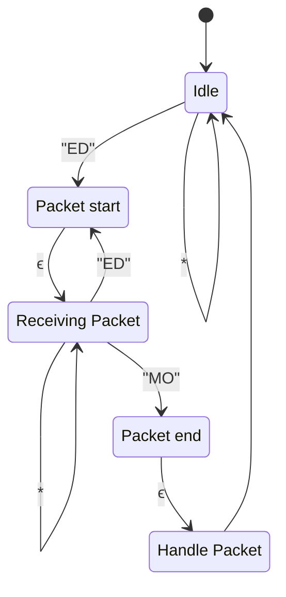

# Fundamentals

The communication format of the EDMO project is binary messages. Binary communication is chosen as it is able to much more efficiently pack information compared to other communication formats such as JSON, XML or pure ASCII. Beyond that, binary transmission allows for the information to be extracted more efficiently, as we can send/receive bytes that maps directly to a C/C++ struct, without the need for special parsing.

The basic structure of the communcation packet is as follows:

|PacketHeader `byte[]`  | Instruction/Command `byte` | Payload  | PacketFooter  `byte[]` |
|:--------------:|:-------------------:|:--------:|:--------------:|
|     "ED""      |        0            | "Spidey" |      "MO"      |

## Packet header and footer
With serial and UDP, there is no guarantee that packets are received in full (or at all). In order to better mitigate such issues, the EDMO packet format uses a header and footer to mark the start and end of the packet respectively.

The packet header will signal the unconditional start of a new packet. Upon encountering it, any bytes received through the communication channel after will be treated as the part as the packet body.

> Note: If the receiver is currently receiving a packet, and another packet header is received. The current packet is dropped completely, and the receiver will start receiving the new packet.

The packet footer signals the end of a packet, this ensures that a packet is only interpreted and handled when the packet is received in full. If the footer never arrives, then the packet is never handled.

> Note 1: If the receiver is not currently receiving a packet, and a footer is encountered, nothing happens.

The following is a mermaid diagram describing the packet reception state machine:

## Escaping and unescaping packets
Due to the use of packet headers and footers, it is essential that the content of the packet (command + payload) is escaped to ensure that the content doesn't contain stray headers/footers.

> If the content contains stray header and footer sequences. Then the packet may be interrupted, causing packets to be dropped due to incorrect format.

The escape character used is "`\`", which can be placed in between the header and footer characters. This is then removed during the unescaping procedure.

The three sequences that are explicitly escaped in the EDMO project is as follows:

* "ED" -> "E\\D"
* "MO" -> "M\\O"
* "\\" -> "\\\\"

> If "\\" precedes any character, it will be removed without losing the subsequent character.

## Packet Descriptions
### Identification command

The identification command/packet is used to obtain the unique identifier and capabilities of an EDMO robot. The command also includes a 128-bit UUID, used to identify the server instance, and used as to lock the robot when the session starts. Preventing other servers on the same network from connecting.

The response payload contains the identifier as a null-terminated c-string. It then announces the number of oscillators that is present on the robot, along with the colour/hue of the arms, which is used by the Server to determine how many controllers can be assigned to a session, and their assigned colour. It also contains a bit to indicate whether the robot is being actively controlled by another server.

#### Command
|PacketHeader `byte[]`  | Instruction/Command `byte` | Identifier `UUID` | PacketFooter `byte[]`  |
|:--------------:|:-------------------:|:---------:|:---:|
|     "ED""      |        `0`           | `123e4567-e89b-12d3-a456-426614174000` |   "MO"      |
#### Response

|PacketHeader `byte[]`  | Instruction/Command `byte` | Null-terminated identifier `char[]` | Oscillator count `byte` | Limb hues `float[]` | Lock `byte` | PacketFooter `byte[]`  |
|:--------------:|:-------------------:|:---------:|:--------------:|:---:|:---:|
|     "ED""      |        `0`            | "Spidey" |  `4` | `0 90 180 270` | `0`|  "MO"      |

### Session start packet
A command packet that signals to the robot to start a session. Upon starting a session, the robot will periodically send [state updates](#send-all-data) based on its internal clock.

The command packet also includes a reference timestamp. This is used to offset the internal clock used in the IMU timestamps.

Upon receiving this command, the robot will apply a session lock, prevent other servers from establishing control.

#### Command
|PacketHeader `byte[]`  | Instruction/Command `byte` | Reference time `uint` | PacketFooter `byte[]`  |
|:--------------:|:-------------------:|:---:|:---------:|
|     "ED""      |        `1`           | `2560` |   "MO"      |

### Session end packet
A command packet that signals to the robot to end a session. Upon starting a session, the robot will stop sending state updates.

Upon receiving this command, the robot will release a session lock, allowing other servers to establish control.

#### Command
| PacketHeader `byte[]`  | Instruction/Command `byte` | PacketFooter `byte[]`  |
|:--------------:|:-------------------:|:---------:|
|     "ED""      |        `6`           |   "MO"    |

#### Response
N/A

### Get time packet
A simple packet used to request the internal time of the robot. This can be used as a reference time for [Session start packet](#session-start-packet)

#### Command
| PacketHeader `byte[]`  | Instruction/Command `byte` |PacketFooter `byte[]` |
|:--------------:|:-------------------:|:---------:|
|     "ED""      |        `2`           |   "MO"     |

#### Response

|PacketHeader `byte[]`  | Instruction/Command `byte` | Internal time  `uint` |PacketFooter `byte[]`  |
|:--------------:|:-------------------:|:---:|:---------:|
|     "ED""      |        `2`            |`2560`|   "MO"      |

### Oscillator update packet
This packet contains (potentially) updated parameters for a single oscillator. This is then applied to the oscillator with some easing.

#### Command
|PacketHeader `byte[]`  | Instruction/Command `byte` | Oscillator index `byte` | Frequency `float` | Amplitude `float` | Offset `float` | Phase Shift `float` |PacketFooter `byte[]`  |
|:--------------:|:-------------------:|:---------:|:---:|:---:|:---:|:---:|:---:|
|     "ED""      |        `3`          | `0` | `0.5` | `90` | `90` | `3.14`|    "MO"      |

#### Response
N/A

### Oscillator State packet

This packet contains information about the current state of the oscillator, including the current frequency, amplitude, offset, phase shift, and phase.
> All things related to parameters take into account the eased value, and may be part of the transitionary period of the parameters.

"Phase" is a synonym for $t$ (the current time).

#### Command
|PacketHeader `byte[]`  | Instruction/Command `byte` | PacketFooter `byte[]`  |
|:--------------:|:-------------------:|:---------:|
|     "ED""      |        `4`            |   "MO"      |

#### Response 
The number of response packet varies with the number of oscillators present on the robot.

|PacketHeader `byte[]`  | Instruction/Command `byte` | Oscillator index `byte` | Frequency `float` | Amplitude `float` | Offset `float` | Phase Shift `float`  |Phase `float`|PacketFooter `byte[]`  |
|:--------------:|:-------------------:|:---------:|:---:|:---:|:---:|:---:|:---:|:--:|
|     "ED""      |        `3`          | `0` | `0.5` | `90` | `90` | `3.14`|`25`|    "MO"      |

### IMU Data packet
This packet contains the information collected by the connected IMU accessory (if present). 

For each sensor reported by the IMU, there is a timestamp associated with it, this timestamp may be identical between multiple IMU data packets, as the sensor report rate may be limited by the hardware.

Each sensor reading also includes accuracy information, provided by the IMU hardware to indicate the confidence of the reading.

> If the sensor is not present, all values in the `SensorInfo<T>` struct is `0`.

#### Command
|PacketHeader `byte[]`  | Instruction/Command `byte` | PacketFooter `byte[]`  |
|:--------------:|:-------------------:|:---------:|
|     "ED""      |        `5`            |   "MO"      |

#### Response
|PacketHeader `byte[]`  | Instruction/Command `byte` | Gyroscope data `SensorInfo<vec3>` | Accelerometer data `SensorInfo<vec3>` | Magnetometer data `SensorInfo<vec3>` | Gravity data `SensorInfo<vec3>` |  Rotation data `SensorInfo<quartenion>` |PacketFooter `byte[]`  |
|:---:|:---:|:---:|:---:|:---:|:---:|:---:|:---:|
|"ED"|`5`|`(x,y,z)`|`(x,y,z)`|`(x,y,z)`|`(x,y,z)`| `(x,y,z,w)`|"MO"|

##### SensorInfo<T>
| Timestamp `uint` | Accuracy `byte` | Padding bytes `byte[3]` | Information `T`|
|:---:|:---:|:---:|:---:|

### Send all data

This packet is used to obtained batched information. Oscillator state data, IMU readings and the current timestamp is acquired in a single packet, minimising overhead associated with individual packet.

This also ensures an "all-or-nothing" approach when it comes to receiving data, making sure that the number of IMU packets is identical to the number of oscillator state packets.

#### Command
|PacketHeader `byte[]`  | Instruction/Command `byte` | PacketFooter `byte[]`  |
|:--------------:|:-------------------:|:---------:|
|     "ED""      |        `69`            |   "MO"      |

#### Response

|Packet Header `byte[]`| Internal time  `uint`
|:---:|:---: |
|"ED"| `2860`|

**_Repeat the oscillator state for every oscillator on the robot._**

|Oscillator index `byte` | Frequency `float` | Amplitude `float` | Offset `float` | Phase Shift `float`  |Phase `float`|
|:---:|:---:|:---:|:---:|:---:|:---:|
|  `3`          | `0` | `0.5` | `90` | `90` | `3.14`|`25`|

|Gyroscope data `SensorInfo<vec3>` | Accelerometer data `SensorInfo<vec3>` | Magnetometer data `SensorInfo<vec3>` | Gravity data `SensorInfo<vec3>` |  Rotation data `SensorInfo<quartenion>` |
|:---:|:---:|:---:|:---:|:---:|
`(x,y,z)`|`(x,y,z)`|`(x,y,z)`|`(x,y,z)`| `(x,y,z,w)`|

|Packet Footer `byte[]`|
|:---:|
|"MO"|

