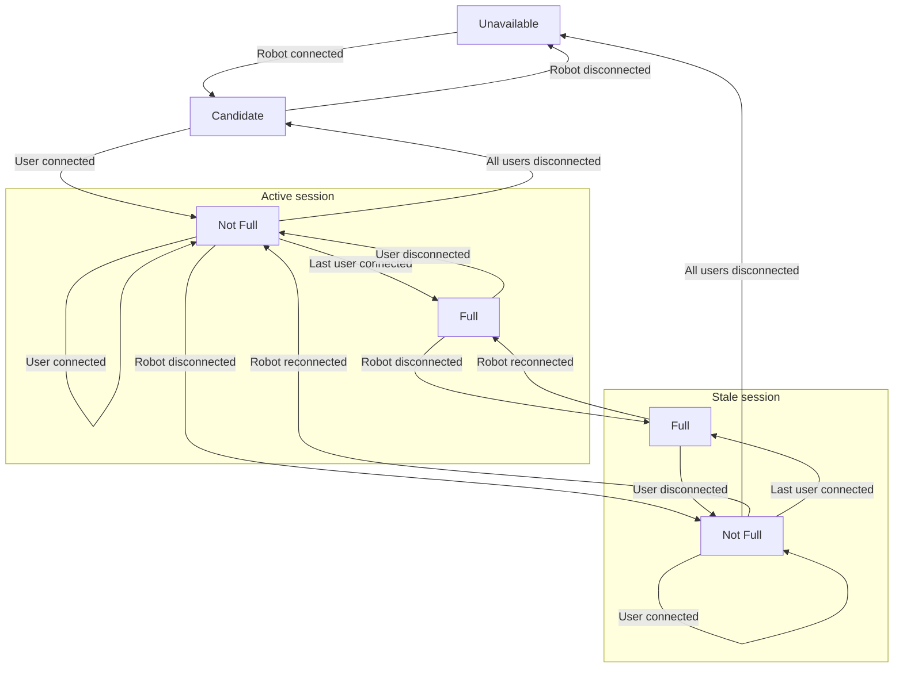

# Session Manager
This manager is the top level entry point for most user-facing clients.

The session manager keeps track of each robot's availability, along with their active session (if any). 

Clients are expected to connect to a session via a session manager singleton.

## Session management logic

A session can be in multiple different states. 

* Candidate - A robot is connected, but a session isn't active
    + If a user attempts to take control of the robot, then a new session will be created
* Active - A robot is connected, and a session is active
    + The session officially begun, and control and data collection is in progress
    + Users may join in if the session is not full
* Stale - Robot has disconnected, but a session is still active
    + This state is meant as a "limbo state", serving as an opportunity for the session to continue when the robot reconnects
    + Users may still join despite the lack of robot, if the session is not full
        - The EDMO study frontend doesn't show stale sessions in the candidate list, but a user may still directly/manually connect
* Unavailable - Robot has disconnected, and no active sessions exist
    + User will be forbidden from joining

The following is a flowchart on how session management works.

## Implementation detail
State management is inherently single-threaded. A semaphore is used to ensure that no race conditions occur when multiple clients simultaneously try to connect to candidate sessions, causing multiple sessions to be created for the same robot.

